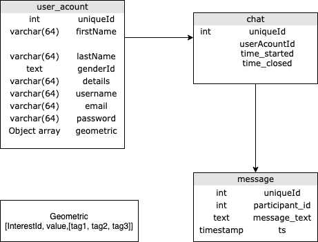
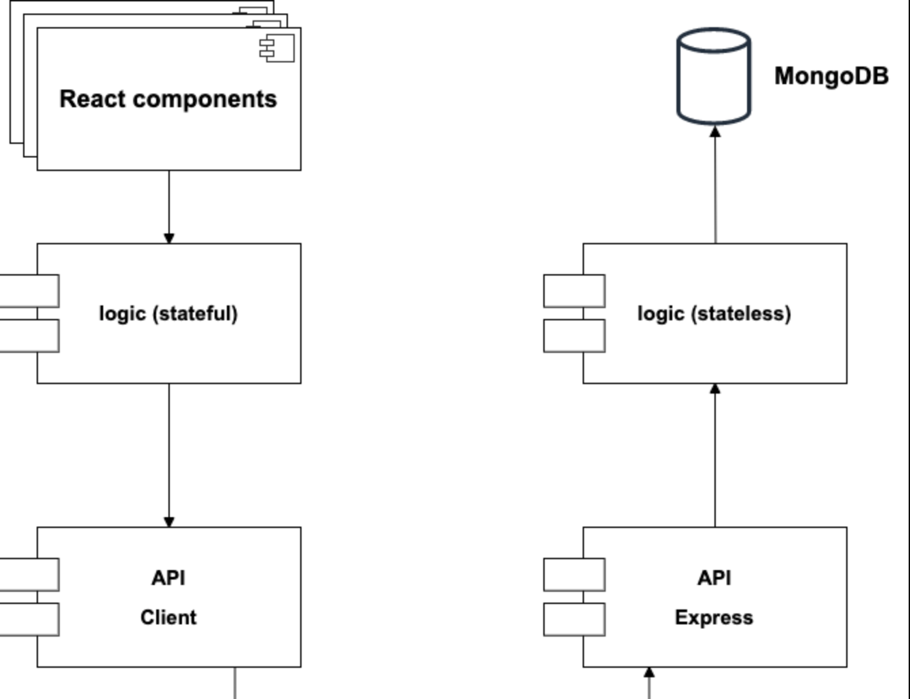
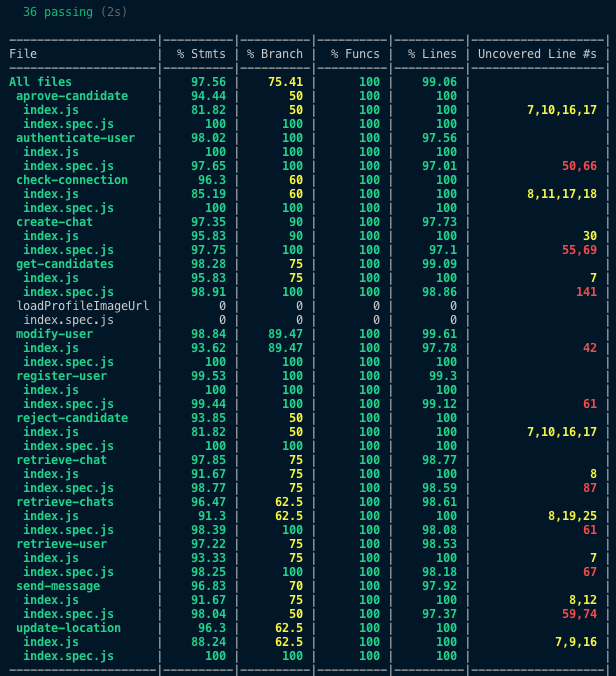

#Affinity
##Introduction:
Welcome to affinity! 
The main goal of this project would be to create a swipping app, but with a less superficial match criteria as the current ones. The idea of match would remain the same, the main diference would reside in the lack of pictures on the first presentation. Instead of the classic profile picture, a colored pictogram based on the user's main interests would be generated, which upon closer inspection users could see more specific information.

The user may add a description of himself, which in the context of a pictureless first aproach, it gains significant importance.

If two users match, they'll be able to get to know each other better by the means of a chat. 

### Data Model

### API databaflow

### API coverage

